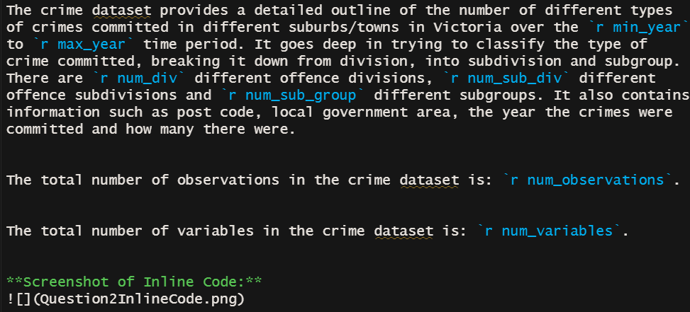
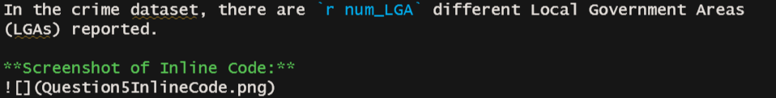
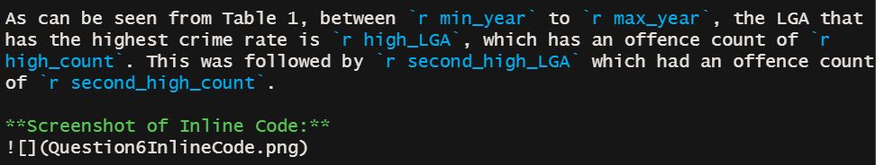
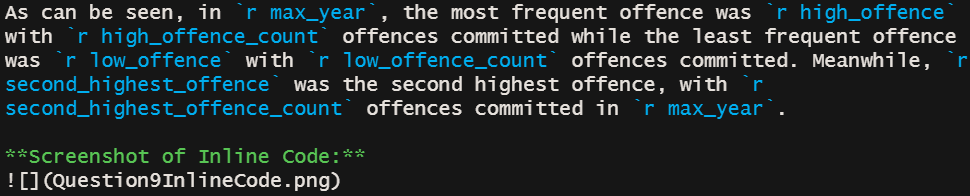
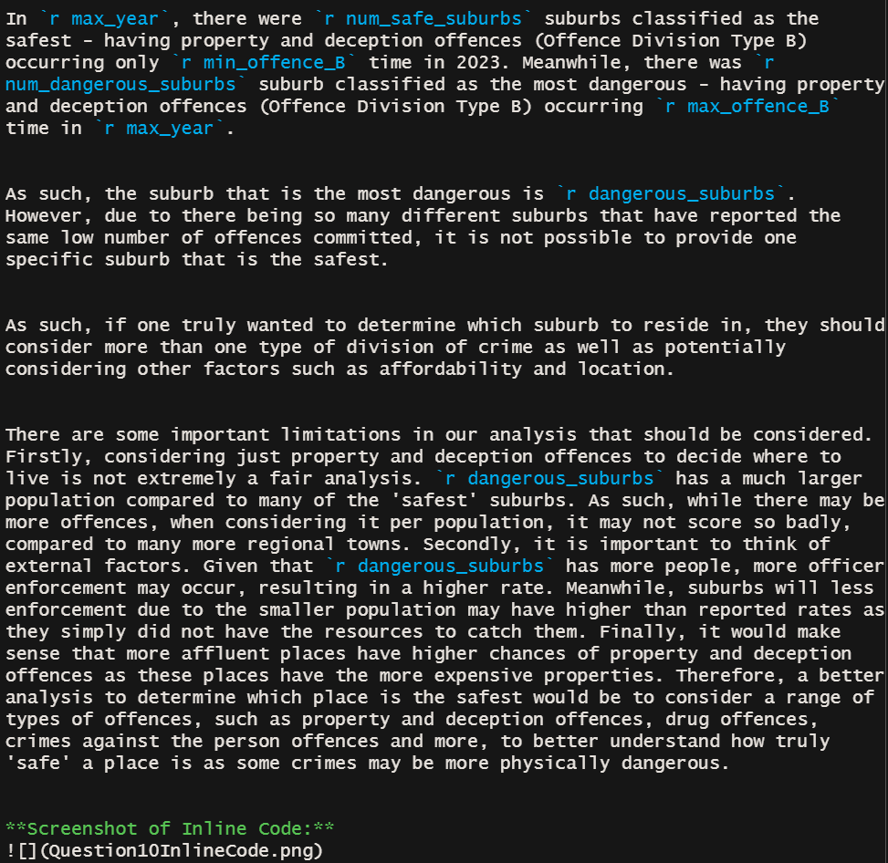

```{=html}
<style>
body {
text-align: justify}
</style>
```
```{r setup, include=FALSE}
knitr::opts_chunk$set(
  echo = TRUE,
  warning = FALSE,
  message = FALSE
)

options(scipen = 10)
```

```{r load-packages, message=FALSE}
# Load the required packages
library(tidyverse) 
library(kableExtra)
library(readr)
```

# Question 1:
```{r q1, message=FALSE, warning=FALSE}
crime <- read_csv("data/offences.csv") # Read in the data
```

# Question 2:
```{r q2}
num_observations <- nrow(crime) # Determine the number of observations as observations in tidy data are in rows
num_variables <- ncol(crime) # Determine the number of variables as variables in tidy data are in columns

# Determine the number of different ways to classify a type of crime
num_div <- length(unique(crime$`Offence Division`)) 
num_sub_div <- length(unique(crime$`Offence Subdivision`))
num_sub_group <- length(unique(crime$`Offence Subgroup`))

# Determine the maximum and minimum year of the data collected
max_year <- max(crime$Year)
min_year <- min(crime$Year)
```


The crime dataset provides a detailed outline of the number of different types of crimes committed in different suburbs/towns in Victoria over the `r min_year` to `r max_year` time period. It goes deep in trying to classify the type of crime committed, breaking it down from division, into subdivision and subgroup. There are `r num_div` different offence divisions, `r num_sub_div` different offence subdivisions and `r num_sub_group` different subgroups. It also contains information such as post code, local government area, the year the crimes were committed and how many there were. 


The total number of observations in the crime dataset is: `r num_observations`.


The total number of variables in the crime dataset is: `r num_variables`.


**Screenshot of Inline Code:**  


# Question 3:
```{r q3}
variable_names <- names(crime) # Extract the column (variable) names 
```

The variables in the crime dataset are: `r variable_names`.


**Screenshot of Inline Code:**  


# Question 4:
The datatypes for the different variables are determined below.
```{r a4}
str(crime) #Look at the datatype of the different variables 
```

All of the data types are formatted correctly and align with the expected formatting. For instance, `Year endings`, `Local Government Area`, `Suburb/Town Names`, `Offence Division`, `Offence Subdivision` and `Offence Subgroup` all consist of words and are, therefore, categorised as 'characters'. 

However, it's worth noting that the data type for `Year ending` could potentially be better suited as 'integer' rather than 'character'. This change would involve converting the month names into their respective numbers, such as changing "March" to 3. Furthermore, it's interesting to observe that the variable `Year ending` contains only one observation - March. Consequently, it's possible to consider this entire column as redundant.

In relation to the remaining variables - `Year`, `Postcode`, `Offence Count`, they are classified as 'numeric' which is appropriate. Additionally, even though they are 'numeric', they are currently labeled as 'doubles'. A more appropriate classification might be to categorise them as 'integers', given that `Year`, `Postcode` and `Offence Count` inherently consist of whole numbers and not decimals.

# Question 5:
```{r q5}
num_LGA <- crime |>
  select(`Local Government Area`) |> # Only want LGAs
  unique() |> # Need to remove any duplicates of the same LGA
  nrow() # Number of rows equate to number of LGAs
```

In the crime dataset, there are `r num_LGA` different Local Government Areas (LGAs) reported.

**Screenshot of Inline Code:**  


# Question 6:
The top 10 LGAs and their associated crime rates can be seen in Table 1.
```{r q6}
# Determine the amount of crime each suburb had reported over time
LGA_crimes <- crime |>
  select(`Local Government Area`, `Offence Count`) |>
  filter(!is.na(`Offence Count`)) |> # Removes any offence counts that are NA
  pivot_wider(names_from = `Local Government Area`,
              values_from = `Offence Count`,
              values_fn = sum) |> # This operation was done to be able to sum up the offence counts in the different LGAs
  pivot_longer(everything(), names_to = "Local Government Area", values_to = "Crime") |> # This was done so that the table could be presented in the format style it is
  arrange(desc(Crime))

# Present the data in a nice kable table format
LGA_crimes |>
  head(10) |> # Only shows the top 10
  kable(caption = "Table 1: Top 10 Crime rates between 2014-2023 and associated LGAs.") |>
  kable_styling(latex_options = c("hold_position"))

# Determine the highest LGA and the crime count associated with it
high_LGA <- LGA_crimes[1, 1]
high_count <- LGA_crimes[1, 2]

# Determine the second highest LGA and the crime count associated with it
second_high_LGA <- LGA_crimes[2, 1]
second_high_count <- LGA_crimes[2, 2]

```

As can be seen from Table 1, between `r min_year` to `r max_year`, the LGA that has the highest crime rate is `r high_LGA`, which has an offence count of `r high_count`. This was followed by `r second_high_LGA` which had an offence count of `r second_high_count`.

**Screenshot of Inline Code:**  


# Question 7:
```{r q7}
# Determine the number of crimes per year
crime_per_year <- crime |>
  group_by(Year) |>
  summarise(Total_Crime = sum(`Offence Count`, na.rm = TRUE))

# Display the number of crimes per year 
crime_per_year |>
  ggplot(aes(x = Year,
             y = Total_Crime,
             col = "Offences committed a year")) +
  geom_line() +
  ylab("Offences Committed") +
  xlab("Time (Year)") +
  ggtitle("The Total Number of Criminal Offences per Year ")

```


As we can see from this graph, the total number of criminal offences increased rapidly in 2015 and continued to increase all the way until 2017. Between 2017 to 2018 there was a dip that eventually returned to a similar offence levels in 2020. From 2020 to 2022, we see there is a drastic drop. This drop is most likely be due to COVID-19 measures that were taken including people staying at home, having a 5km zone limit and a curfew that reduced the offences committed. The rise in offences from 2022 to 2023 may be due to these restrictions easing and society returning back to usual.  

# Question 8:
```{r q8}
#  Determine the different divisions of crime committed each year 
offence_types <- crime |> 
  filter(!is.na(`Offence Count`)) |> 
  group_by(Year, `Offence Division`) |>
  summarise(Count_Offence_Types = sum(`Offence Count`))

# Display the different divisions of crime committed each year
offence_types |> 
  ggplot(aes(x = Year, y = Count_Offence_Types, col = `Offence Division`)) +
  geom_line() +
  ylab("Offences Committed") +
  xlab("Time (Year)") + 
  ggtitle("The Different Types of Criminal Offences per Year")

```

As can be seen from this figure, Property and deception offences (Type B) are drastically more common between 2014 and 2023. Additionally, Type B seemed to have the most volatility. As can be seen, it has two peaks (2017 and 2020), however, seems to be on a downwards trend. 


Crimes against the person (Type A), Drug offences (Type C) and justice procedure offences (Type E) seem to be slowly growing over time with a slightly upward trend. Out of the three, Type E seems to be growing the fastest.


Meanwhile public order and security offences (Type D) seem to be on a very gradual decline. Other offences (Type F) could be argued to be consistent.


While the most volatile offence is Type B, we see from the figure that Type C and Type F both have a spike/peak in 2021, potentially related to COVID-19 and the lockdown measures causing more drug and other offences.

# Question 9:
```{r q9}
# Determine the frequency of each offence
offences_2023 <- crime |>
  filter(Year == 2023) |>
  group_by(`Offence Division`) |>
  summarise(Total_Offences_2023 = sum(`Offence Count`, na.rm = TRUE)) |>
  mutate(first_letter = substr(`Offence Division`, 1, 1)) # Attaches the letter associated with each type in a separate column - necessary to label the plot x-axis

# Display the frequency of each offence
offences_2023 |>
  ggplot(aes(x = `Offence Division`, y = Total_Offences_2023, fill = `Offence Division`)) +
  geom_bar(stat = "identity") +
  ylab("Offences Committed") +
  xlab("Offence Division in 2023") +
  ggtitle("The Frequency of Each Form of Offence in 2023") +
  geom_text(aes(label = Total_Offences_2023), vjust = -0.3) + # Lets you put the label over each bar 
  scale_x_discrete(labels = offences_2023$first_letter) #labels the x-axis with the first letters 

# Arrange the data in order from highest to lowest offence
arranged_offences <- offences_2023 |>
  arrange(-Total_Offences_2023)

# Determine the highest, second highest and lowest offences and offence counts in 2023
high_offence <- arranged_offences[1, 1]
high_offence_count <- arranged_offences[1, 2]
low_offence <- arranged_offences[nrow(offences_2023), 1]
low_offence_count <- arranged_offences[nrow(offences_2023), 2]
second_highest_offence <- arranged_offences[2, 1]
second_highest_offence_count <- arranged_offences[2, 2]
```

As can be seen, in `r max_year`, the most frequent offence was `r high_offence` with `r high_offence_count` offences committed while the least frequent offence was `r low_offence` with `r low_offence_count` offences committed. Meanwhile, `r second_highest_offence` was the second highest offence, with `r second_highest_offence_count` offences committed in `r max_year`.

**Screenshot of Inline Code:**  


# Question 10:
```{r q10}
# Determine how many Type B offences each suburb had in 2023, from lowest to highest
offence_B <- crime |>
  filter(Year == 2023)  |>
  filter(substr(`Offence Division`, 1, 1) == "B") |> # Find all of the offence types that start with B
  group_by(`Suburb/Town Name`) |>
  summarise(Total_Offence_B = sum(`Offence Count`, na.rm = TRUE)) |>
  arrange((Total_Offence_B))

# Find the minimum and maximum number of offence B's committed 
min_offence_B <- min(offence_B$Total_Offence_B)
max_offence_B <- max(offence_B$Total_Offence_B)

# Find all the safest suburbs
safest_suburbs <- offence_B |>
  filter(Total_Offence_B == min_offence_B) |>
  select(`Suburb/Town Name`)

# Find all the dangerous suburbs
dangerous_suburbs <- offence_B |>
  filter(Total_Offence_B == max_offence_B) |>
  select(`Suburb/Town Name`)

# Determine how many safest and most dangerous suburbs there are
num_safe_suburbs <- nrow(safest_suburbs)
num_dangerous_suburbs <- nrow(dangerous_suburbs)
```

In `r max_year`, there were `r num_safe_suburbs` suburbs classified as the safest - having property and deception offences (Offence Division Type B) occurring only `r min_offence_B` time in 2023. Meanwhile, there was `r num_dangerous_suburbs` suburb classified as the most dangerous - having property and deception offences (Offence Division Type B) occurring `r max_offence_B` time in `r max_year`.


As such, the suburb that is the most dangerous is `r dangerous_suburbs`. However, due to there being so many different suburbs that have reported the same low number of offences committed, it is not possible to provide one specific suburb that is the safest.


As such, if one truly wanted to determine which suburb to reside in, they should consider more than one type of division of crime as well as potentially considering other factors such as affordability and location. 


There are some important limitations in our analysis that should be considered. Firstly, considering just property and deception offences to decide where to live is not extremely a fair analysis. `r dangerous_suburbs` has a much larger population compared to many of the 'safest' suburbs. As such, while there may be more offences, when considering it per population, it may not score so badly, compared to many more regional towns. Secondly, it is important to think of external factors. Given that `r dangerous_suburbs` has more people, more officer enforcement may occur, resulting in a higher rate. Meanwhile, suburbs will less enforcement due to the smaller population may have higher than reported rates as they simply did not have the resources to catch them. Finally, it would make sense that more affluent places have higher chances of property and deception offences as these places have the more expensive properties. Therefore, a better analysis to determine which place is the safest would be to consider a range of types of offences, such as property and deception offences, drug offences, crimes against the person offences and more, to better understand how truly 'safe' a place is as some crimes may be more physically dangerous. 


**Screenshot of Inline Code:**  
